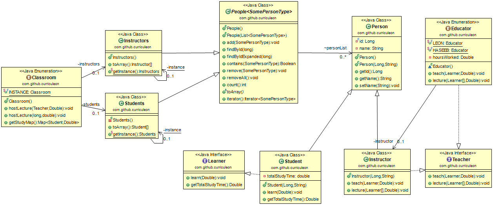

# Leon's Lengthy Learner Lab
* **Objective**
	* to implement a `Classroom` class which _mediates_ a _composite_ `Students` and `Instructors` _singleton_ reference.
* **Purpose**
	* to demonstrate the use of:
		* [interfaces](https://stackoverflow.com/questions/1321122/what-is-an-interface-in-java)
		* [abstract classes](https://stackoverflow.com/questions/1320745/abstract-class-in-java)
		* [concrete classes](https://stackoverflow.com/questions/43224901/what-is-the-concrete-class-in-java)
		* [enums](https://stackoverflow.com/questions/4709175/what-are-enums-and-why-are-they-useful)
		* [generics](https://stackoverflow.com/questions/7815528/what-are-generics-in-java/7815579)
* **Description**
	* To implement a system which abides by the UML displayed below. * Click [here](./README.md) to view the most up-to-date README.md

### Part 1.0, 1.1 - Create `Person` Class
* Click [here](./docs/README-person.md) to view instructions on how to create and test `Person` class.

### Part 2.0, 3.0, 3.1 - Create `Student` class
* Click [here](./docs/README-student.md) to view instructions on how to create and test `Student` class.

### Part 4.0, 5.0, 5.1 - Create `Instructor` class
* Click [here](./docs/README-instructor.md) to view instructions on how to create and test `Instructor` class.

### Part 6.0, 6.1 - Create `People` class
* Click [here](./docs/README-people.md) to view instructions on how to create and test `People` class.

### Part 7.0, Part 7.1 - Create `Students` singleton
* Click [here](./docs/README-students.md) to view instructions on how to create and test `Students` class.

### Part 8.0 - Create and Test `Instructors` singleton
* Click [here](./docs/README-instructors.md) to view instructions on how to create and test `Instructors` class.

### Part 9.0, 9.1 - Create `Classroom` Class
* Click [here](./docs/README-classroom.md) to view instructions on how to create and test `Classroom` class.

# Notice the Design Flaw - Odd Casting Issues

### Part 10.0, 10.1, 10.2, 10.3 - Generifying The People Class
* Click [here](./docs/README-refactor.md) to view instructions on how to generify the project.
